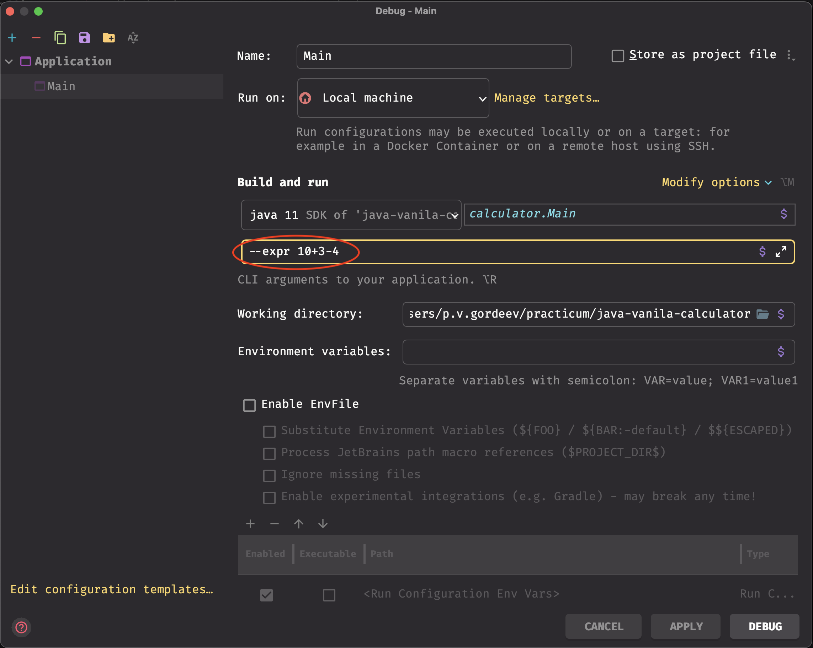

# Простой калькулятор

## Как запускать
Через интерфейс запуска класса в IDEa 
можно указать аргументы для работы программы. Есть 2 варианта запуска:
1. написать выражение прямо в аргументах запуска, для этого нужно указать аргументы `--expr {выражение}`
2. передать имя файла, где будет записано выражение, тогда нужно указать `--file {полный путь до файла}`

На данный момент поддерживаются только сложение и вычитание.

### Задание:
Во всех местах, где есть строка `// todo Добавить свой код здесь` нужно доработать код так,
чтобы калькулятор смог считать. 